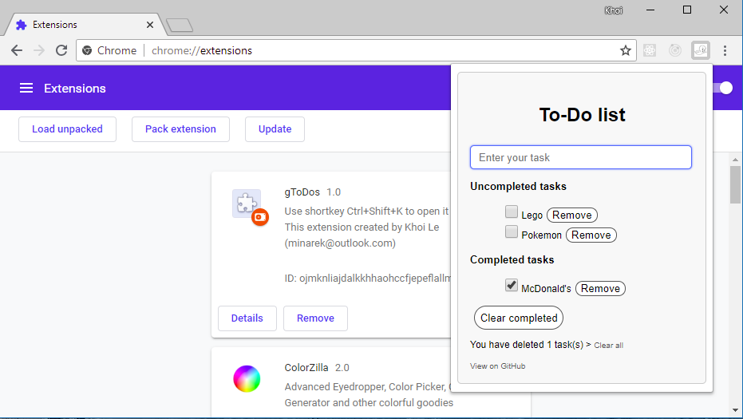

# Chrome extension - To-Do list
This project based on [React-Redux To-Do list](https://github.com/nguyenkhois/react-redux-todo-list-adv). Visit this repository if you want to know more about what I have created. That's the interest and helpful. (^_^)

## Screenshot

## Installation
* Step 1: Clone this repository or download [direct zip file](assets/chrome-extension-todo-list.zip).
* Step 2: Install this extension by turning on Developer mode in Chrome. You may want to view how to install an extension on your local computer [here](https://developer.chrome.com/extensions/getstarted#unpacked).

## Notes
* I created this extension to learn myself about [React-Redux](https://redux.js.org/basics/usagewithreact) and want to know how a SAP ([Single-Page Applications](https://en.wikipedia.org/wiki/Single-page_application)) works as a [Chrome extension](https://developer.chrome.com/extensions).
* Your data saved on your local computer by [localStorage](https://developer.mozilla.org/en-US/docs/Web/API/Window/localStorage).
* This extension does not care about your person information or another things.
* YOU ARE SAFE 100%! (^_^)